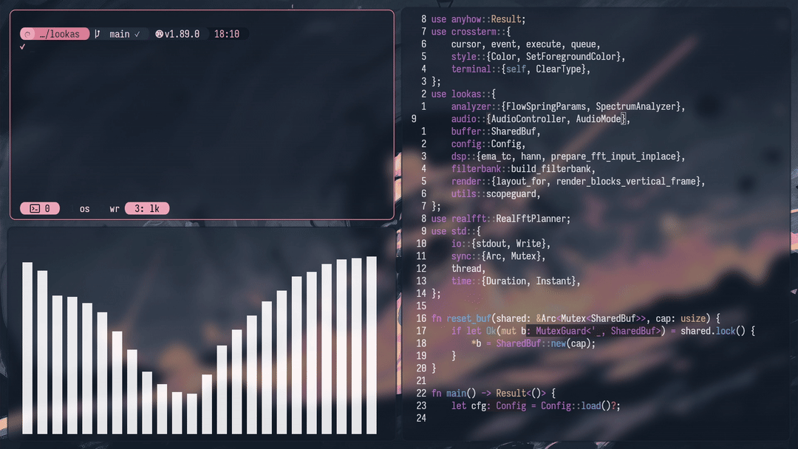

<h1 align="center">osyx</h1>

<p align="center">
  <a href="https://github.com/rccyx/osyx/actions"></a>
  <a href="https://www.debian.org/releases/trixie/"></a>
  <a href="https://github.com/rccyx/osyx"></a>
  <a href="https://github.com/rccyx/osyx/blob/main/LICENSE"></a>
</p>


### Demos

<a href="https://youtu.be/6Hd7L2aBmFk">
  
</a>

<a href="https://youtu.be/03FGf8kWCvE">
  
</a>

<a href="https://www.youtube.com/watch?v=agGcxm24N84">
  
</a>

<a href="https://youtu.be/hfwcOR_xJJA">
  
</a>

## TL;DR

This project, is a highly engineered stack of tooling, configurations, scripts, and custom software that transforms a completely blank, TTY only Debian into the slick, keyboard driven workspace you saw in the demos.

Not just a collection of dots (although pure dots are found [here](./config/)).

Debian is treated mostly as a stable [substrate](/.github/workflows/on-workflow-call-bootstrap.yml) and package source (starts off without even having `sudo`).

> [!IMPORTANT]
> Some configurations, scripts, programs, etc, are kept private until they're stable enough to release. The rest is here as a mirror and reference material, take what you want.

## Explainers

If you want to dig through:

- [Starting](./docs/starting.md) (Want the eye candy? Theme switching, wallpapers, hypr, etc? How to go by this)
- [Workflow](./docs/workflow.md) (If you reach for a mouse, you've already lost)
- [Stack](./docs/stack.md) (If it ain't broke don't fix it)
- [Philosophy](./docs/philosophy.md) (Overall premise and why I'm doing this)

## Custom Tools

These are standalone tools written from scratch, that can be airdropped into any distro. Open sourced gradually (when stable):

### [Lookas](https://github.com/rccyx/lookas)

A terminal audio visualizer built around human auditory perception. Moves beyond raw FFT twitchiness using Mel-scaling and spring damper physics.

```sh
cargo install lookas && lookas
```

<p align="center">
  <a href="https://github.com/rccyx/lookas">
    
  </a>
</p>

### [Asryx](https://github.com/rccyx/asryx)

The transcription program from the demo.

Native Linux ASR binary. Written in C++ and embedded via whiser.cpp's C API, daemonless, offline, no bloat, no GUI, no config overhead.

<p align="center">
  <a href="https://github.com/rccyx/asryx">
    
  </a>
</p>

### Thyx (Next)

A QML based SDDM login screen with video backgrounds, fingerprint auth, and a composable design system. Terraform like state management for installation/uninstallation. Contains absolutely zero bloat, and fully configurable.


### Powyx (Unreleased)

The glassmorphic power menu from the demo.

### Jarvis (Unreleased)

A headless CLI control center built to reduce the GUI footprint to just the browser and the editor. The central nervous system of the OS. Much of it is hardcoded to my setup and will be rolled out here gradually.

## And more...

There's more to come.

> [!TIP]
> This is a long term thing. So you might follow through.

## License

Apache-2.0 © @rccyx
